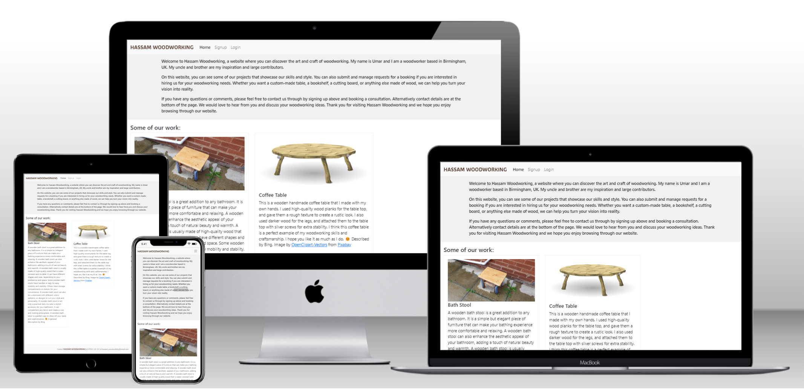
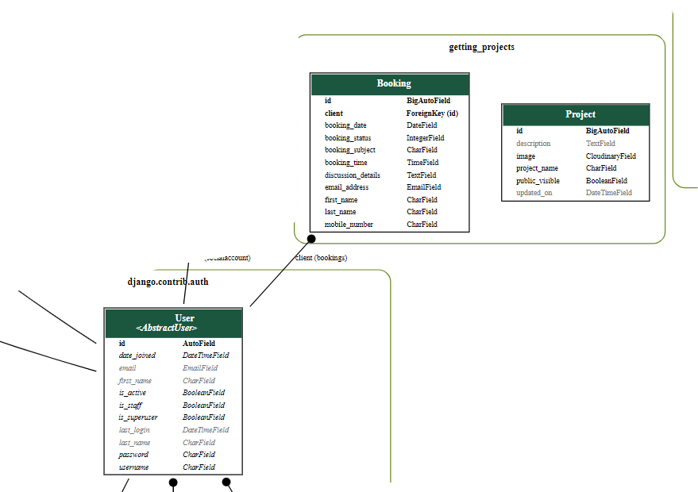
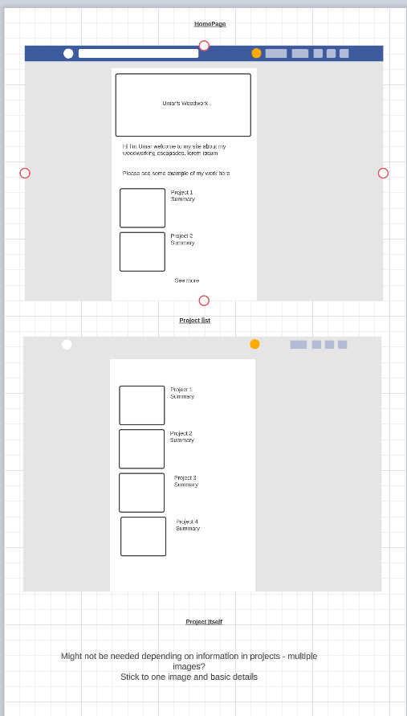
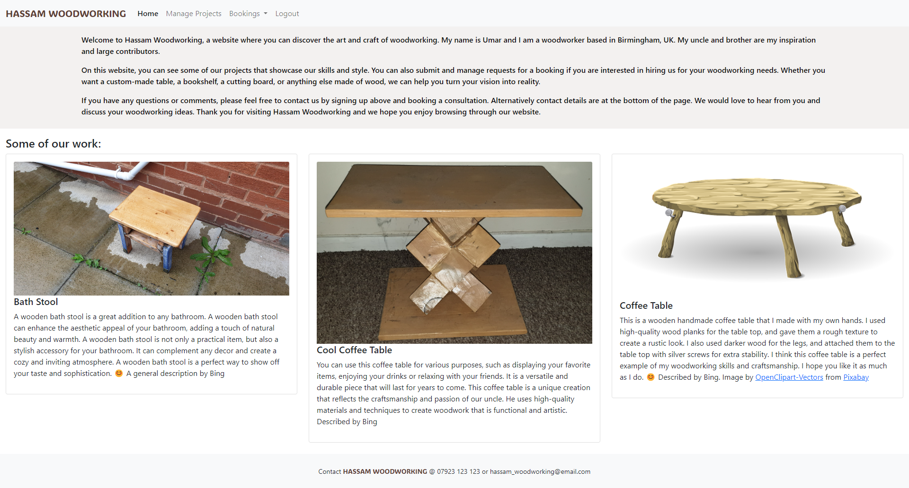
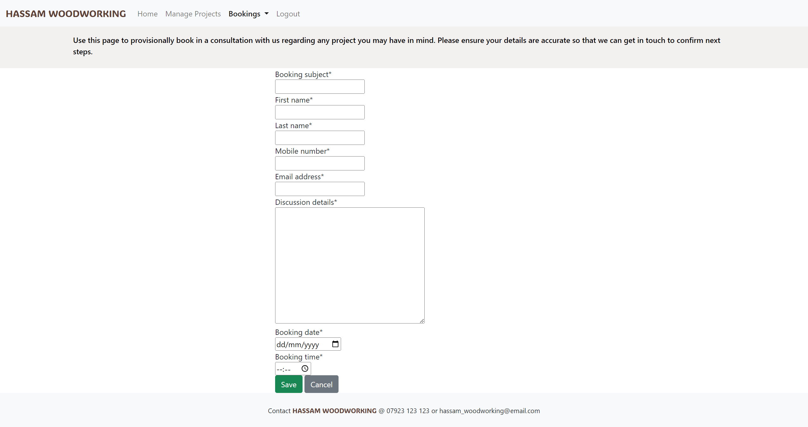
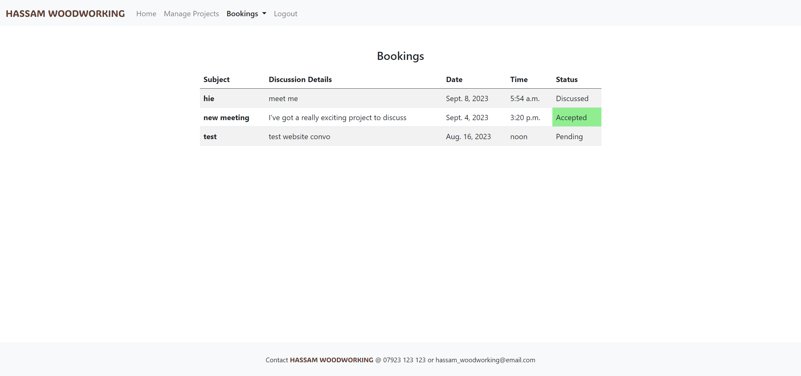
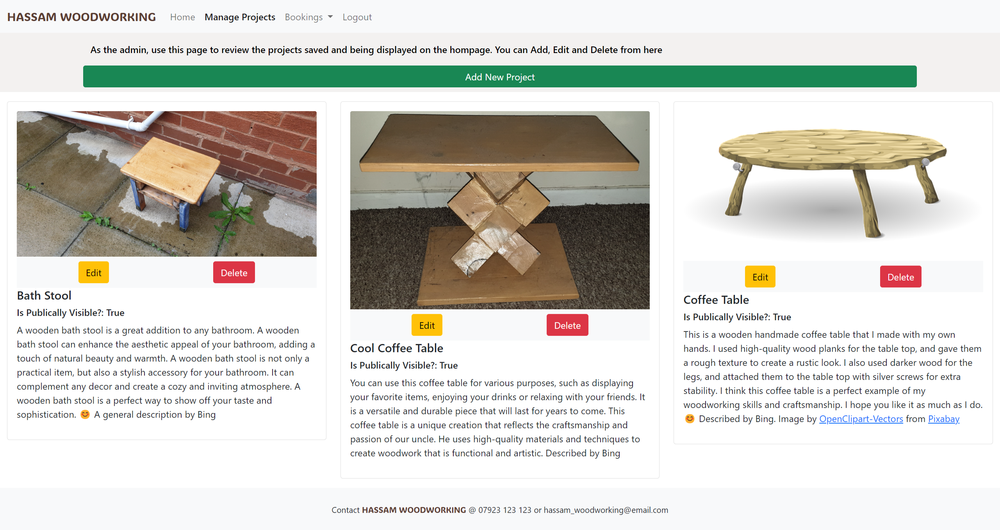

# Umar's Imaginary Woodworking

Umar's Imaginary Woodworking is inspired by my uncle and my brother. My uncle is an avid woodworker and has produced some awesome pieces andmy brother is starting on is journey. Unfortunately, I have been unable to include much of their work at this time. This is a little site as if we are woodworker and carpenter taking bookings for consultations and work. We are able to upload and showcase our projects and visitors to the site are able to login and make and manage bookings for consultations/appointments with us. Hence the webpage now says Hassam Woodworking

**Live site: [HERE](https://umars-woodworking-78c6e707aec6.herokuapp.com/)**

## Contents

- [Umar's Imaginary Woodworking](#umars-imaginary-woodworking)
  - [Contents](#contents)
  - [UX Design](#ux-design)
    - [The Strategy Plane](#the-strategy-plane)
      - [User Stories](#user-stories)
    - [The Scope Plane](#the-scope-plane)
    - [The Structure Plane](#the-structure-plane)
    - [The Skeleton Plane](#the-skeleton-plane)
    - [The Surface Plane](#the-surface-plane)
  - [Features](#features)
    - [Homepage and Projects](#homepage-and-projects)
    - [Submit a Consultation Booking](#submit-a-consultation-booking)
    - [View Own Bookings](#view-own-bookings)
    - [Admin Bookings](#admin-bookings)
    - [Admin Projects](#admin-projects)
  - [Technologies](#technologies)
  - [Testing](#testing)
  - [Deployment, forking, cloning](#deployment-forking-cloning)
    - [Deployment](#deployment)
    - [Cloning](#cloning)
    - [Forking](#forking)
  - [Credits](#credits)

## UX Design

I identified 4 potential types of users:

1. Just browsing - this is someone who just happens on the page and may be drawn in
1. Someone looking for a specific project - this is someone who has arrived with a purpose that we may be able to fulfill
1. Already has an account, book and manage consultations and appointments - a satisfied and returning
1. The admin user - in this imaginary situation - would be myself and eventually a hired administrator

### The Strategy Plane

The vision is to provide a family the ability to showcase their woodworking that they're passionate about in order to get customers and start a conversation. The design should be robust and practical - suitable for people interested in durable and sustainable wooden products.

#### User Stories

I used the Agile Methodology in this project. I defined the User Stories that I believed I needed for the MVP. I defined Acceptance Criteria and assigned the User Stories to milestones. The milestones did not quite work out in staying separately but are the sections of the User Experience/Journey I defined and used. I loosely utilised the MoSCoW prioiritisation techinque by using GitHub issue labels for must-have, could-have and should-have. I did not waste time coming up with wont-haves in this project.

All the User Stories are listed below. As you can see a couple of the ones that are not must-have are not yet complete

**Title**|**Assignees**|**Status**|**Labels**|**Milestone**
:-----:|:-----:|:-----:|:-----:|:-----:
[USER STORY: Navigation](https://github.com/UHassam0/Umars-woodworking/issues/3)|UHassam0|Done|must have|Homepage
[USER STORY: Accept/Reject meeting requests](https://github.com/UHassam0/Umars-woodworking/issues/7)|UHassam0|Done|could have|Bookings
[USER STORY: Changes notifications - user](https://github.com/UHassam0/Umars-woodworking/issues/13)|UHassam0|Done|must have|Bookings
[USER STORY: Changes notifications](https://github.com/UHassam0/Umars-woodworking/issues/12)|UHassam0|Done|must have|Example Projects
[USER STORY: Review meeting requests](https://github.com/UHassam0/Umars-woodworking/issues/6)|UHassam0|Done|must have|Bookings
[USER STORY: Request meeting](https://github.com/UHassam0/Umars-woodworking/issues/5)|UHassam0|Done|must have|Bookings
[USER STORY: View my bookings/meeting requests](https://github.com/UHassam0/Umars-woodworking/issues/10)|UHassam0|Done|should have|Bookings
[USER STORY: Edit Example Projects](https://github.com/UHassam0/Umars-woodworking/issues/4)|UHassam0|Done|must have|Example Projects
[USER STORY: Delete Projects](https://github.com/UHassam0/Umars-woodworking/issues/9)|UHassam0|Done|must have|Example Projects
[USER STORY: Register](https://github.com/UHassam0/Umars-woodworking/issues/1)|UHassam0|Done|must have|Authorisation
[USER STORY: Add new projects](https://github.com/UHassam0/Umars-woodworking/issues/8)|UHassam0|Done|must have|Example Projects
[USER STORY: Projects - view full details](https://github.com/UHassam0/Umars-woodworking/issues/11)|UHassam0|To Do|should have|Example Projects
[USER STORY: Change meeting status when passed](https://github.com/UHassam0/Umars-woodworking/issues/14)|UHassam0|To Do|could have|Bookings
[USER STORY: Display example projects](https://github.com/UHassam0/Umars-woodworking/issues/2)|UHassam0|Done|must have|Homepage
[USER STORY: Edit bookings](https://github.com/UHassam0/Umars-woodworking/issues/15)|UHassam0|Done|must have|Bookings

### The Scope Plane

- The admin user should be able to easily manage the products loaded and visible on the website
- The visitor should be able to view the portfolio of projects curated by the admin
- The visitor/user should be able to login
- The visitor/user should be able to book a consultation and view booked consultations

### The Structure Plane

[Link to full data model](./readme_images/django-data-model.png)

The core model I designed and utilised:

Key things to note is the relation between the Booking and the User. I opted against uploading images for bookings at this stage but considered it as a possibility. Some people may find it useful, but the impact would be low as the next stage of the User Journey is to speak 'offline' and this could be covered more effectively with the expertise required. A picture would be less necessary and could be a blocker on the user journey.

The Project Model is separate and would be for the admin to manage and upload an image and give a blurb to advertise it to visitors to the website

### The Skeleton Plane

I used lucidchart to draw some basic wireframes to cover the main pages

In words: the aim is to keep this simple, both as this is a Minimum Viable Product (MVP) and in line with the aesthetic of the main audience that is likely to be more practical. The main page is the homepage, with a simple navbar and footer, a brief 'sales pitch' and the portfolio of projects. From here users can click to login or sign up from the Nav bar and then this reveals the link to 'Book a Consultation' (a form page). It also allows the user to see their own bookings when they click 'View Bookings'

While this view is helpful for the admin, the main page him/her is the 'Manage Projects' page. This view allows visibility of all projects and and whether or not they are publically visible at a glance. It also links to forms to edit or delete as needed. Similarly the admin has access to all upcoming consultation bookings on another page to be able to contact customers about their enquiries and bookings and edit and/or approve as necessary.

### The Surface Plane

As alluded throughout, the aim is to be simple. I selected the 'ADLaM Display' Google font for the the 'logo' or name as it looks a little like it could be an engraving. I also opted for a brown collour. This stylised name is to be used in both the navbar and footer. A similar lightened brown colour will be used for the paragraph and any instructions at the top of the pages

## Features

### Homepage and Projects

View an intro about the site and see portfolio of projects

### Submit a Consultation Booking

Form to submit to book a consultation

### View Own Bookings

Page for users to view their own bookings

### Admin Bookings

Page to review any upcoming bookings in order to plan, contact clients and edit as necessary

### Admin Projects

Page to review Project portfolio beiong desplayed on homepage with options to edit and delete

## Technologies

I made use of common Full Stack Technologies listed below:

- Django - the main framework
  - django-allauth - to handle authentication
- Bootstrap - styling
- Heroku - Deploymeny and Hosting
- Git/Github - Version Control
- Cloudinary - Static persistent file storage
- ElepahntSQL - PostgreSQL provider

## Testing

Testing detailed in [TESTING.md](TESTING.md)

## Deployment, forking, cloning

### Deployment

Deployed using these [deployment instructions](https://docs.google.com/document/d/1P5CWvS5cYalkQOLeQiijpSViDPogtKM7ZGyqK-yehhQ/edit#heading=h.5s9novsydyp1)

1. Set up Codeanywhere Workspace using [Code Institute Template](https://github.com/Code-Institute-Org/ci-full-template)
2. Use pip3 to install libraries:
   - pip3 install 'django<4' gunicorn - stuck to older version (slightly) familiar with
   - pip3 install dj_database_url==0.5.0 psycopg2 - supporting libraries
   - pip3 install dj3-cloudinary-storage - staic file storage
   - pip3 install urllib3==1.26.15 - supporting library for cloudinary static storage
   - pip3 install django-allauth - library to handle authentication
   - use python3 manage.py to start project and appp
   - pip3 freeze --local > requirements.txt - for heroku to know what to install
   - Set up env.py with SECRET_KEY, DATABASE_URL (Create New Instance on ElephantSQL if you haven't already) and CLOUDINARY_URL - ensuring that it is in the.gitignore file so is not commited and credentials are not compromised

3. If when you use python3 manage.py runserver to see that the Django app is correctly created then you may/will need to add the url to ALLOWED HOSTS in setttings.py
4. Create project in Heroku and link Github Repository
5. Add env.py variables as Config Vars, as well as PORT = 8000 and DISABLE_COLLECTSTATIC = 1.
6. Ensure when Django Project complete that you have set 'Debug = False' in settings.py and removed DISABLECOLLECTSTATIC Config Var. This is for both functionality and security so incredibly important

### Cloning

You may use the URL of this Code Repository to clone it for yourself in your directory and Code Editor of choice using the git clone command

### Forking

You may [fork this repo](https://docs.github.com/en/get-started/quickstart/fork-a-repo). You need to click on fork just above the code to the right of the page beneath the header of this page. You can also use git commands in the command line

## Credits

- My uncle for leading the inspiration
- My mentor Harry Dhillon for his advice and support
- I used Bing Chat to generate some of the text displayed on the site
- Made use of Stack Overflow and many other web resources. Some Key ones listed below
  - [CreateView help](https://stackoverflow.com/questions/35751772/setting-current-user-on-django-vanilla-createview)
  - [CreateView help](https://stackoverflow.com/questions/63550890/how-to-pass-logged-users-id-to-createview)
  - [Form Help](https://stackoverflow.com/questions/66248147/could-someone-explain-why-we-return-super-form-validform-in-form-valid-metho)
  - [Form date field fix](https://forum.djangoproject.com/t/cant-change-type-attribute-in-django-crispy-forms/10054/11)
  - [Top 5 errors accoring to Google](https://www.pingdom.com/blog/the-5-most-common-http-errors-according-to-google/)
  - [remove bootstrap button line](https://stackoverflow.com/questions/66436957/how-to-remove-the-small-blue-line-in-bootstrap-buttons)
  - [Image from](https://pixabay.com/users/clker-free-vector-images-3736/?utm_source=link-attribution&utm_medium=referral&utm_campaign=image&utm_content=24260)</a>
  - [Footer from here](https://startbootstrap.com/snippets/sticky-footer-flexbox)
  - [footer stick to bottom](https://dev.to/nehalahmadkhan/how-to-make-footer-stick-to-bottom-of-web-page-3i14)
  - [active nav link](https://stackoverflow.com/questions/19268727/django-how-to-get-the-name-of-the-template-being-rendered)
  - [Mock-Up Generator](https://techsini.com/multi-mockup/index.php)
