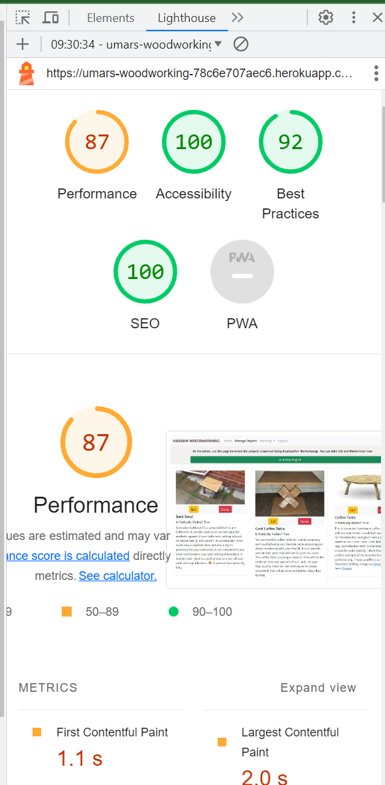
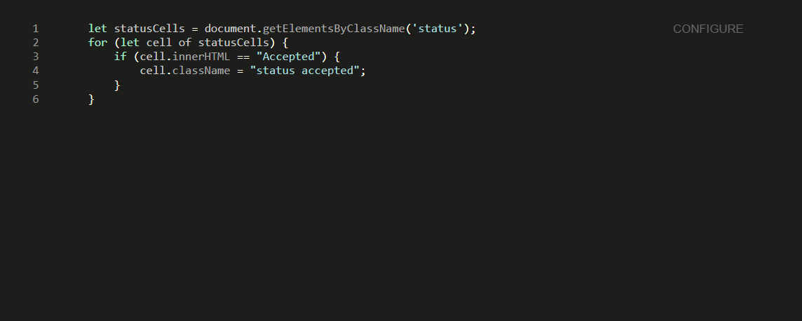

# Testing

### Responsiveness Testing

I have been able to use the site on my phone with no issue and have used chrome developer tools and the mockup generator linked in credits to test this and spotted no issues

### Bugs Resolved and Unresolved

collectstatic match cloudinary to workspace especially overwrite/replace style.css from walkthrough
not auto completing slug on create projects page
not notifying user when projects created - although takes back to manage projects and shows it there at the top
homepage horizontal scroll required
cancel button on edit

### Lighthouse testing

Lighthouse scoring is dropping slightly on the performance due to image files size. This is only on the manage projects page(lighthouse screeecnshot below). Going forward images uploaded should definitely be compressed and perhaps look at alternatives to Cloudinary. However, this is not currently a significant problem

### Code Validation

#### Python

All my Python code has passed through the [CI Python Linter](https://pep8ci.herokuapp.com/) with no issues

#### JavaScript

My JavaScript snippet passed through [JSHint](https://jshint.com/) with no issues

#### HTML

All source code passed through the [W3C Validator](https://validator.w3.org/nu/#textarea) with no errors for each page

#### CSS

My CSS source code passed through the [W3C CSS Validator](https://jigsaw.w3.org/css-validator/validator) with no errors

### User Story Testing

**Title**|**Acceptance Criteria**|**Evaluation**
:-----:|:-----:|:-----:
[USER STORY: Accept/Reject meeting requests](https://github.com/UHassam0/Umars-woodworking/issues/7)|Simple button to update|Checked and Passed in development and in deployed
[USER STORY: Add new projects](https://github.com/UHassam0/Umars-woodworking/issues/8)| page to add projects|Checked and Passed in development and in deployed
[USER STORY: Add new projects](https://github.com/UHassam0/Umars-woodworking/issues/8)| creates new projects|Checked and Passed in development and in deployed
[USER STORY: Add new projects](https://github.com/UHassam0/Umars-woodworking/issues/8)| validates and gives feedback|Checked and Passed in development and in deployed
[USER STORY: Add new projects](https://github.com/UHassam0/Umars-woodworking/issues/8)| only accessible to superuser|Checked and Passed in development and in deployed
[USER STORY: Changes notifications - user](https://github.com/UHassam0/Umars-woodworking/issues/13)|Any notification - whether new page or page alert|Checked and Passed in development and in deployed
[USER STORY: Changes notifications](https://github.com/UHassam0/Umars-woodworking/issues/12)|Any notification - whether new page or page alert|Checked and Passed in development and in deployed
[USER STORY: Delete Projects](https://github.com/UHassam0/Umars-woodworking/issues/9)| Only Site Admin can make changes|Checked and Passed in development and in deployed
[USER STORY: Delete Projects](https://github.com/UHassam0/Umars-woodworking/issues/9)| Can Delete projects|Checked and Passed in development and in deployed
[USER STORY: Display example projects](https://github.com/UHassam0/Umars-woodworking/issues/2)| Projects display on homepage|Checked and Passed in development and in deployed
[USER STORY: Display example projects](https://github.com/UHassam0/Umars-woodworking/issues/2)| Display clearly with image and brief description|Checked and Passed in development and in deployed
[USER STORY: Edit bookings](https://github.com/UHassam0/Umars-woodworking/issues/15)| Edit page to edit meeting requests|Checked and Passed in development and in deployed
[USER STORY: Edit bookings](https://github.com/UHassam0/Umars-woodworking/issues/15)| Can edit all fields|Checked and Passed in development and in deployed
[USER STORY: Edit Example Projects](https://github.com/UHassam0/Umars-woodworking/issues/4)| Only Site Admin can make changes|Checked and Passed in development and in deployed
[USER STORY: Edit Example Projects](https://github.com/UHassam0/Umars-woodworking/issues/4)| Can Edit Details, Show/Hide|Checked and Passed in development and in deployed
[USER STORY: Navigation](https://github.com/UHassam0/Umars-woodworking/issues/3)| Can go to Login/Signup, bookings, make a booking, and example projects|Checked and Passed in development and in deployed
[USER STORY: Navigation](https://github.com/UHassam0/Umars-woodworking/issues/3)| Nav bar is easy to use and doesn't obstruct anything|Checked and Passed in development and in deployed
[USER STORY: Register](https://github.com/UHassam0/Umars-woodworking/issues/1)| Can create an account with basic details|Checked and Passed in development and in deployed
[USER STORY: Register](https://github.com/UHassam0/Umars-woodworking/issues/1)| Login/Register/logout buttons on Navbar|Checked and Passed in development and in deployed
[USER STORY: Request meeting](https://github.com/UHassam0/Umars-woodworking/issues/5)| be able to input sufficient detail|Checked and Passed in development and in deployed
[USER STORY: Request meeting](https://github.com/UHassam0/Umars-woodworking/issues/5)| Visual confirmation that the meeting request is sent and pending|Checked and Passed in development and in deployed
[USER STORY: Review meeting requests](https://github.com/UHassam0/Umars-woodworking/issues/6)| Be able to see enough details such as contact information|Checked and Passed in development and in deployed
[USER STORY: View my bookings/meeting requests](https://github.com/UHassam0/Umars-woodworking/issues/10)| page to view any upcoming bookings|Checked and Passed in development and in deployed
[USER STORY: View my bookings/meeting requests](https://github.com/UHassam0/Umars-woodworking/issues/10)| only view own bookings|Checked and Passed in development and in deployed

### Features Testing
