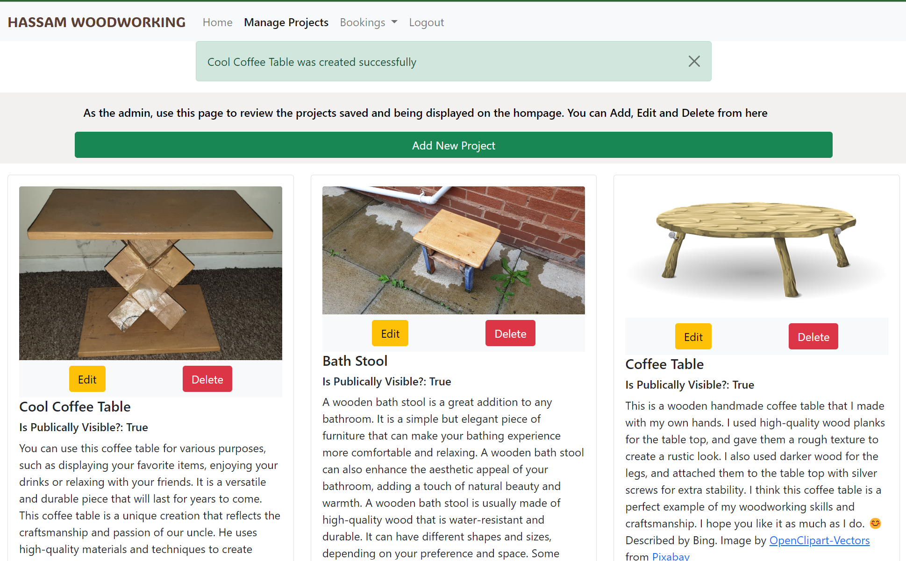

# Testing

As the code has been self-explanatory and uses the genric class based view, there has not been much need for code comments. Similarly, if statements and for loops have successfully been handled in the Django templates.

Error 404 has been tested but I have also created templates for the 5 most common erros according to Google as linked in my Credits in the README

### Responsiveness Testing

I have been able to use the site on my phone with no issue and have used chrome developer tools and the mockup generator linked in credits to test this and spotted no issues

### Bugs Resolved and Unresolved

I had some issues with static (css) file duplication in Cloudinary. I managed to resolve this by deleting files in Clouidnary and running collectstatic a few times to match Cloudinary to workspace. I believe the problem may have started bccause the style.css from walkthrough Django Blog was still there. I made sure to repeat the 'python3 manage.py collectsatic' command before final deployment.

Django was not auto completing the slug on create projects page or in general when creating projects. Forunately, I did not need to expend time trying to figure out why as I decided that the slug was not necessary and I would be ok or better off using the primary key id.

There were 2 (not must-haves) User Stories that I did not complete due to time-constraints. One was for the User to be able to click on a Project and have it open in a new page with all the details in a better format. The other was to have a new status option on bookings that is automatically selected when the date for the booking has passed. However, I am not sure that this was necessary anyhow.

While not a bug as such the alert messages push down the content of the page and are not the best in terms od User Experience. However, it is acceptable for an MVP.

### Lighthouse testing

Lighthouse scoring is dropping slightly on the performance due to image files size. This is only on the manage projects page(lighthouse screeecnshot below). Going forward images uploaded should definitely be compressed and perhaps look at alternatives to Cloudinary. However, this is not currently a significant problem

### Code Validation

#### Python

All my Python code has passed through the [CI Python Linter](https://pep8ci.herokuapp.com/) with no issues

#### JavaScript

My JavaScript snippet passed through [JSHint](https://jshint.com/) with no issues

#### HTML

All source code passed through the [W3C Validator](https://validator.w3.org/nu/#textarea) with no errors for each page

#### CSS

My CSS source code passed through the [W3C CSS Validator](https://jigsaw.w3.org/css-validator/validator) with no errors

### User Story Testing

As well as testing these myself, I was fortunate to have some User Testing done my father and others. This is what led to the addition of instructions at the tops of some of the pages. I am not certain if his struggle was more to do with his IT literacy or the site

**Title**|**Acceptance Criteria**|**Evaluation**
:-----:|:-----:|:-----:
[USER STORY: Accept/Reject meeting requests](https://github.com/UHassam0/Umars-woodworking/issues/7)|Admin must click through to an edit form|This is available via the Review Upcoming Bookings page. The link and form are both only accessible to a superuser.
[USER STORY: Add new projects](https://github.com/UHassam0/Umars-woodworking/issues/8)| page to add projects|Checked and Passed in development and in deployed
[USER STORY: Add new projects](https://github.com/UHassam0/Umars-woodworking/issues/8)| creates new projects|Checked and Passed in development and in deployed
[USER STORY: Add new projects](https://github.com/UHassam0/Umars-woodworking/issues/8)| validates and gives feedback|Checked and Passed in development and in deployed. However, the UI of the messages could be improved post MVP
[USER STORY: Add new projects](https://github.com/UHassam0/Umars-woodworking/issues/8)| only accessible to superuser|Checked and Passed in development and in deployed. The link is unavailable and the form doesn't load if the user/malicious actor manages to arrive at the page another way. The Restricted Page, return home message is displayed
[USER STORY: Changes notifications - user](https://github.com/UHassam0/Umars-woodworking/issues/13)|Any notification - whether new page or page alert|Checked and Passed in development and in deployed. Handles via the Django message framework and on page alert
[USER STORY: Changes notifications](https://github.com/UHassam0/Umars-woodworking/issues/12)|Any notification - whether new page or page alert|Checked and Passed in development and in deployed. Handles via the Django message framework and on page alert
[USER STORY: Delete Projects](https://github.com/UHassam0/Umars-woodworking/issues/9)| Only Site Admin can make changes|Checked and Passed in development and in deployed. The link is unavailable and the form doesn't load if the user/malicious actor manages to arrive at the page another way. The Restricted Page, return home message is displayed
[USER STORY: Delete Projects](https://github.com/UHassam0/Umars-woodworking/issues/9)| Can Delete projects|Checked and Passed in development and in deployed. Functionality
[USER STORY: Display example projects](https://github.com/UHassam0/Umars-woodworking/issues/2)| Projects display on homepage|Checked and Passed in development and in deployed
[USER STORY: Display example projects](https://github.com/UHassam0/Umars-woodworking/issues/2)| Display clearly with image and brief description|Checked and Passed in development and in deployed
[USER STORY: Edit bookings](https://github.com/UHassam0/Umars-woodworking/issues/15)| Edit page to edit meeting requests|Checked and Passed in development and in deployed
[USER STORY: Edit bookings](https://github.com/UHassam0/Umars-woodworking/issues/15)| Can edit all fields|Checked and Passed in development and in deployed
[USER STORY: Edit Example Projects](https://github.com/UHassam0/Umars-woodworking/issues/4)| Only Site Admin can make changes|Checked and Passed in development and in deployed. The link is unavailable and the form doesn't load if the user/malicious actor manages to arrive at the page another way. The Restricted Page, return home message is displayed
[USER STORY: Edit Example Projects](https://github.com/UHassam0/Umars-woodworking/issues/4)| Can Edit Details, Show/Hide|Checked and Passed in development and in deployed
[USER STORY: Navigation](https://github.com/UHassam0/Umars-woodworking/issues/3)| Can go to Login/Signup, bookings, make a booking, and example projects|Checked and Passed in development and in deployed
[USER STORY: Navigation](https://github.com/UHassam0/Umars-woodworking/issues/3)| Nav bar is easy to use and doesn't obstruct anything|Checked and Passed in development and in deployed
[USER STORY: Register](https://github.com/UHassam0/Umars-woodworking/issues/1)| Can create an account with basic details|Checked and Passed in development and in deployed
[USER STORY: Register](https://github.com/UHassam0/Umars-woodworking/issues/1)| Login/Register/logout buttons on Navbar|Checked and Passed in development and in deployed
[USER STORY: Request meeting](https://github.com/UHassam0/Umars-woodworking/issues/5)| be able to input sufficient detail|Checked and Passed in development and in deployed
[USER STORY: Request meeting](https://github.com/UHassam0/Umars-woodworking/issues/5)| Visual confirmation that the meeting request is sent and pending|Checked and Passed in development and in deployed
[USER STORY: Review meeting requests](https://github.com/UHassam0/Umars-woodworking/issues/6)| Be able to see enough details such as contact information|Checked and Passed in development and in deployed
[USER STORY: View my bookings/meeting requests](https://github.com/UHassam0/Umars-woodworking/issues/10)| page to view any upcoming bookings|Checked and Passed in development and in deployed
[USER STORY: View my bookings/meeting requests](https://github.com/UHassam0/Umars-woodworking/issues/10)| only view own bookings|Checked and Passed in development and in deployed

#### Create Project Success and Success Message

